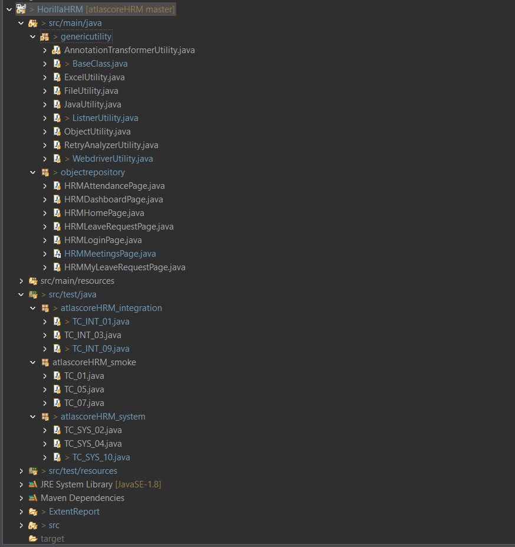
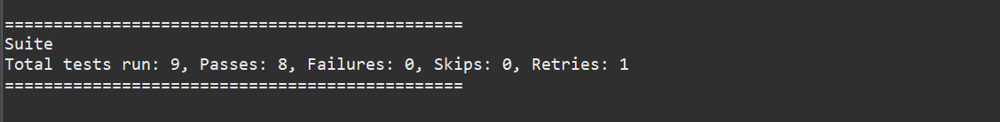
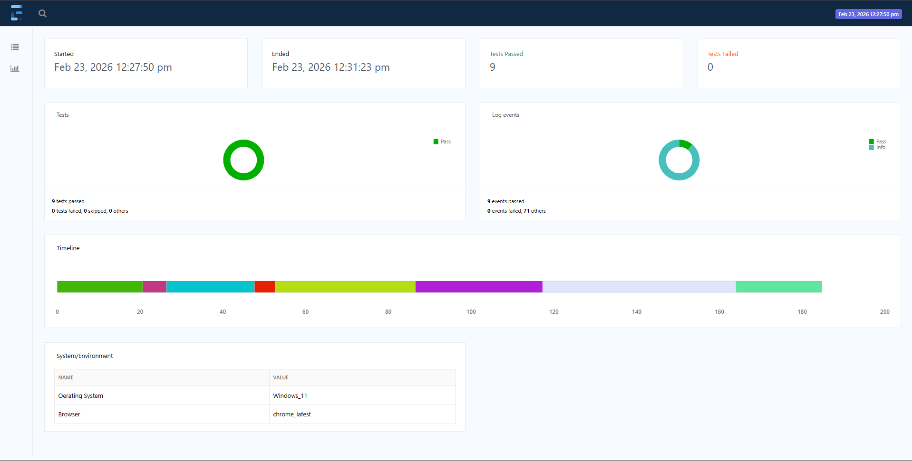
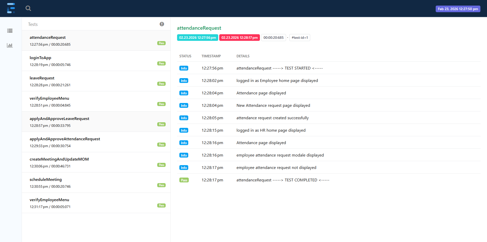

# Selenium Automation Framework – HRM Application

## 👨‍💻 Author
Vasanth A  
Selenium Test Automation Engineer  


## 📌 Overview
This project is a robust Selenium Test Automation Framework developed using Java, TestNG, and Maven.  
The framework is designed using Page Object Model (POM) and supports multiple test levels including smoke, integration, and system testing.

The application under test is configured to run in a local test environment for demonstration purposes.

---

## 🛠 Tech Stack
- Java
- Selenium WebDriver
- TestNG
- Maven
- Page Object Model (POM)
- Extent Reports
- Apache POI (Excel handling)

---

## ✅ Automated Test Coverage

### Smoke Tests
- Login validation
- Basic navigation checks

### Integration Tests
- Core workflow validations
- Module-level verifications

### System Tests
- End-to-end business flow validation
- Cross-module scenarios

---

## 🧱 Framework Features
- Reusable utilities layer  
- Retry mechanism for flaky tests  
- TestNG listeners integration  
- External test data support (Excel & Properties)  
- Extent HTML reporting  
- Suite-based execution control  

---

## ▶️ How to Run the Tests

### Prerequisites
- Java 8+
- Maven installed
- Chrome browser

### Steps

```bash
mvn clean test (or) run specific suite XML from TestNG.

## ▶️ How to view Test reports
After execution, Extent Reports are generated inside the project directory ExtentReport folder for result analysis.

## 📸 Screenshots

### Project Structure


### Test Execution


### Extent Report Dashboard


### Extent Test Details


## 🎥 Automation Execution Demo

▶️ Watch the framework in action:
link : https://youtu.be/0q50ezueKgU
    